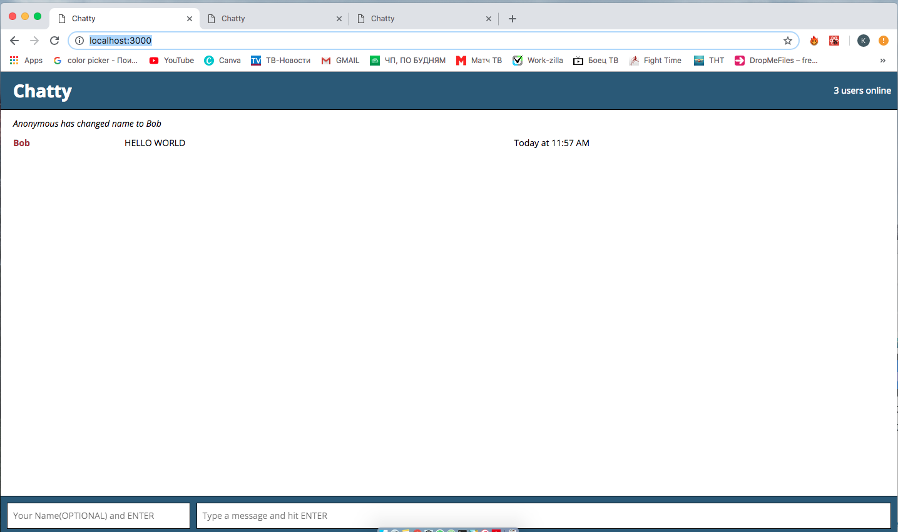
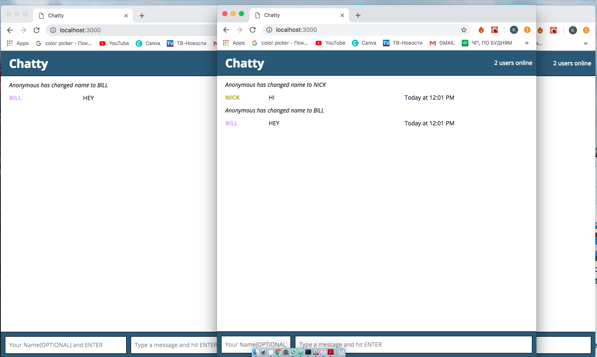

# Chatty App

Chatty App allow users to communicate with each other without having to register accounts. It uses React, as well as modern tools for Node including Webpack and Babel.

## Behaviour

* When any connected user sends a chat message, all connected users receive and display the message.

* When any connected user changes their name, all connected users are notified of the name change.

* Notifications are styled differently from chat messages
* Header will display the count of connected users

* When the number of connected users changes, this count will be updated for all connected users.
* Different users names will each be colored differently

##Final Product

### Screenshot 3 users connected

### Screenshot users assigned different colors

## Dependencies

Go to chatty_server folder
1. Install dependencies using the `npm install`
2. `npm start` to Run Web Socket Server on
<http://localhost:3001/>.
3. Go to <http://localhost:3001/> in your browser.

- express
- ws
- uuid

Go to root folder
1. Install the dependencies using `npm install`
2. `npm start` The app will be served at <http://localhost:3000/>
3. Go to <http://localhost:3000/> in your browser.

- babel-core
- babel-loader
- babel-preset-es2015
- babel-preset-react
- css-loader
- node-sass
- sass-loader
- sockjs-client
- style-loader
- webpack
- webpack-dev-server
- react
- react-dom
- momentjs
- uuid

##Technical Specifications
Stack:

* Webpack with Babel, JSX, ES6
* WebSockets using Node package ws on the server-side, and native WebSocket on client side
* ReactJS
